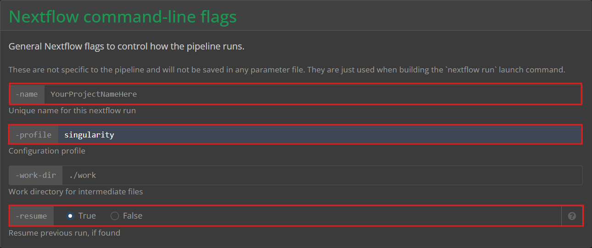
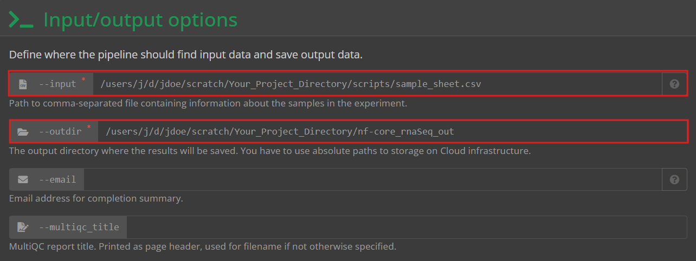
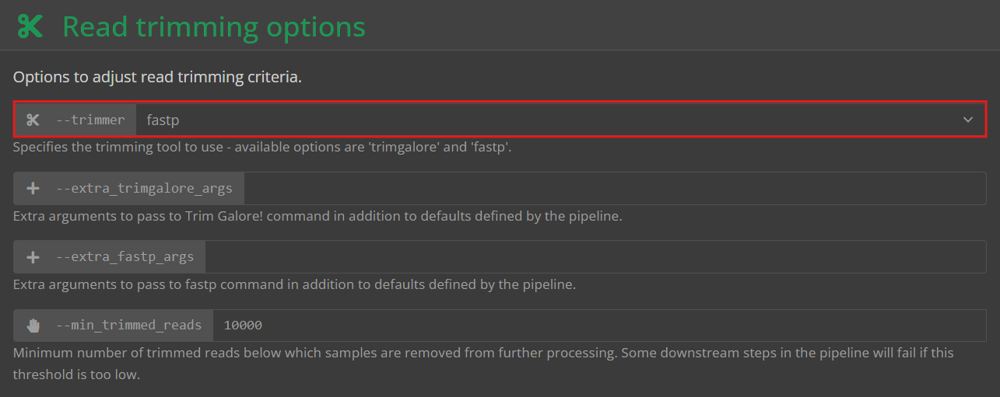
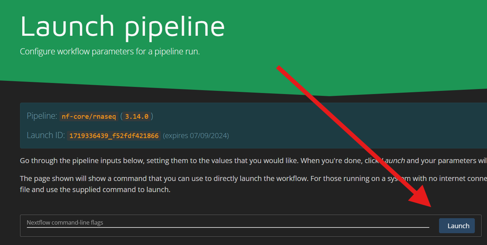
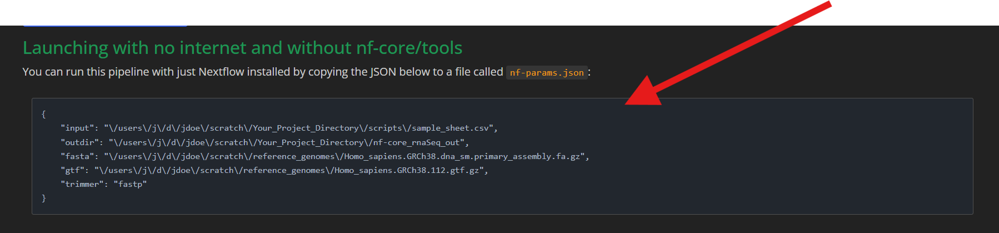
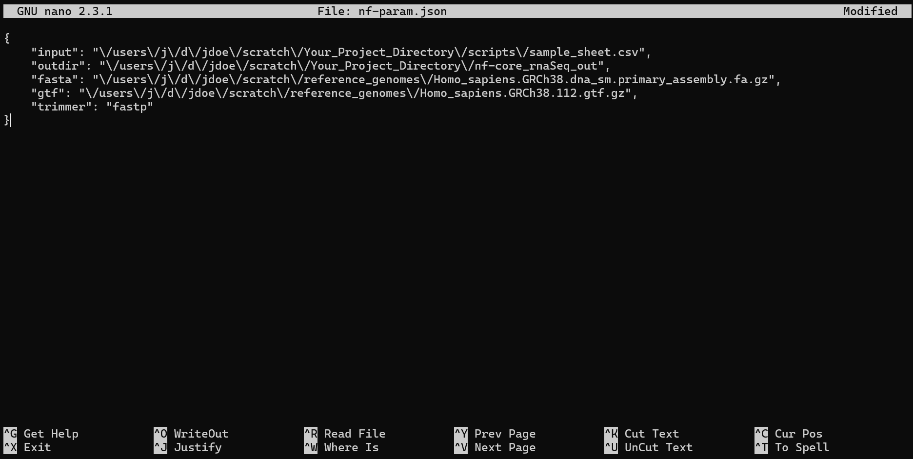
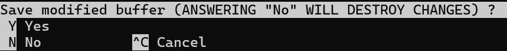
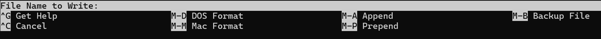

# Tutorial

## Process Outline

1. The VACC  
    * ssh connection
    * file manegment software
    * user account structure
    * VACC navigation
    * checking out computing nodes
2. Installations  
    * Conda, Miniconda, Bioconda
    * Nf-core & Nextflow
    * Singularity (check version/should be installed)
    * reference libraries

3. Directory Organization  

4. Sample Sheets

5. NextFlow pipline setup  
    * param generation
    * adding nnf-params.json to project repo

6. Sbatch Script  
    * parts of your sbatch script  
        * slurm resource/job request
        * env setup
        *Nextflow call command
    * example

7. Runing Your Job  
    * review repo structure
    * preview post submission repo structure
    * submitting an sbatch script to slurm

8. Post Submission Review  
    * check running job progress
    * check completed job slurm statistics

9. Trouble Shooting  

---
---

# **THE VACC**

The Vermont Advanced Computing Center (VACC), provides access to services like data/file managment and high-performance computing clusters used for small and large jobs or workflows.
[University of Vermont VACC](https://www.uvm.edu/vacc)

### SSH Connection

The VACC may be accessed through Secure Shell Protocol (SSH). 

VACC Access With SSH:

1. Open a command prompt or powershell like application
    * [Command Prompt](https://en.wikipedia.org/wiki/Cmd.exe#:~:text=Command%20Prompt%2C%20also%20known%20as,On%20Windows%20CE%20.)
    * [Power Shell](https://en.wikipedia.org/wiki/PowerShell)

2. Within your shell create an SSH connection to the VACC

```
ssh jdoe@vacc-user1.uvm.edu
```
alternatively you can replacee user1 with user2, user3, or user4.  

3. You will then be asked for your password  

    * If done correctly you should be in a directory like below:
    ```
    [jdoe@vacc-user1 jdoe]$
    ```

### File Management Application Connection

If you intend on creating new directories, moving files to the vacc, or downloading vacc hosted files to your computer it may be easier to log in using a file managment application such as [Filezilla](https://filezilla-project.org/). 

To acccess the VACC using a filemanegment the credentials are as follows:

**Host** :  vacc-user1.uvm.edu  
**Username** : first initial + last name  
Example: jdoe  
**Password** : Same as if you logged in through SSH  
**Port** : 22

## VACC Structure 

One of the most important directories in your VACC account is your "**scratch**" directory.  
This is where you will most likely want to store folders and files within your account.  
  
Besides the scratch directory, your home directory contains other stuff in it that is not important to the process. It is important to note though when installing miniconda, and nf-core services you will want to be in your home directory.

## Navigating the VACC

While navigating through files and directories in a file managment application like 
[Filezilla](https://filezilla-project.org/) 
is easy, the process in
[Command Prompt](https://en.wikipedia.org/wiki/Cmd.exe#:~:text=Command%20Prompt%2C%20also%20known%20as,On%20Windows%20CE%20.)
or
[Power Shell](https://en.wikipedia.org/wiki/PowerShell)
is a little more complicated. The navigation of the VACC in these instances will require the use of 
[BASH](https://tiswww.case.edu/php/chet/bash/bashtop.html). 

#### Common Bash Commands

cd -> Use cd followed by a directory name to navigate to that directory  
cd ../ -> Used to navigate to the current directories parent directory  
ls -> Displays all contents of a directory  
pwd -> Displays the current directory path  
mkdir -> Makes a new directory with the given name  
rmdir -> Deletes the given empty directory  
rm -r -> Recursivly deletes a directoy and all contents, ***USE CAREFULLY***  
cat -> Display file contents  
squeue -u -> Displays the active jobs & computing nodes for a given user   
scancel -> Cancels a job with a given job id  
scancel -u -> Cancels all jobs for the given username

  
## VACC Computing Nodes

In order to use the VACC to proccess data or make downloads you must check out a computing node.

This command communicates with SLURM, the VACC's workload manager, to check out a single interactive compute node with 5G of memory and 1 CPU.
```
srun --qos=interactive --mem=5G --cpus-per-task 1 --pty bash
```

---
---
# **Installations**

There are a couple single time installations that you must do to move onto the next step of this process. To continue with installations you must have access to the VACC, using an SSH connection and in a BASH enviroment. 

### Navigate to your home directory

Should look like 
```
[jdoe@vacc-user1 jdoe]$
or
[jdoe@vacc-user1 ~]$
```
Either is fine 


## Conda

The version of Conda you will be installing is [Miniconda](https://docs.anaconda.com/miniconda/#:~:text=Miniconda%20is%20a%20free%20minimal,%2C%20and%20a%20few%20others). This is a bootstrap version of [Anaconda](https://en.wikipedia.org/wiki/Anaconda_(Python_distribution)) that includes only Conda, Python, as well as some important and useful packages.

Navigate to your home directory
```
cd
```
[Install Miniconda](https://docs.anaconda.com/miniconda/#quick-command-line-install)
```
mkdir -p ~/miniconda3
wget https://repo.anaconda.com/miniconda/Miniconda3-latest-Linux-x86_64.sh -O ~/miniconda3/miniconda.sh
bash ~/miniconda3/miniconda.sh -b -u -p ~/miniconda3
rm -rf ~/miniconda3/miniconda.sh
```
Initialize Miniconda for use with BASH and ZSH shells
```
~/miniconda3/bin/conda init bash
~/miniconda3/bin/conda init zsh
```
Add Miniconda to your global path
```
export PATH=~/miniconda3/bin/conda:$PATH
```

[Bioconda](https://bioconda.github.io/#usage) is a specific channel of Conda that provides access to the installation of certain software used in biomedical research. In this case we need to change our Miniconda channel to Bioconda to install NF-Core and Nextflow.
```
conda config --add channels defaults
conda config --add channels bioconda
```

## NF-core & Nextflow

[NF-core](https://nf-co.re/) is a workflow management software. Using NF-core pipelines is a powerful way to ensure experimental reproducability in case something fails, or it must be rerun.

To [install NF-core & Nextflow](https://nf-co.re/docs/nf-core-tools/installation#activate-shell-completions-for-nf-coretools) as one, which is what we want in this case, run the following lines in your VACC home directory.
```
conda create --name nf-core python=3.12 nf-core nextflow
conda activate nf-core
```
After running these lines Bioconda will automatically install NF-core & Nextflow.  

You can check your installation of NF-core by activating an Nf-core enviroment within your SSH connection.
```
conda activate nf-core
```
After running this line you should see something like
```
(nf-core) [jdoe@vacc-user1 ~]$
```
If this does not appear there was most likely an error with the installation.

## Singularity
Singularity is a container software used to containers that hold applications and their needed operating system libraries. Using singularity helps ensure that all needed packages and applications are in a single place in case you were to run your scripts or jobs on another device.   
  
Singularity should be preestablished within your VACC enviroment.  
Ensure Singularity exists within your enviroment with
```
which singularity
```
This should output a path which includes the current version being used.

## Reference Library
In most cases it is required that you install a reference library that nextflow can reference while running. This may library may be specific to your research being conducted.
  
An example of downloading a good reference library for humans from the Ensembl.  
  
Ensure that you are in an empty directory with a name such as "Reference_Genomes" or "Human_Genome_Refrences" so that your reference files can be found easy.
  
Retrieve the latest version of the Ensemble software from its REST API
```
latest_release=$(curl -s 'http://rest.ensembl.org/info/software?content-type=application/json' | grep -o '"release":[0-9]*' | cut -d: -f2)
```
Download their latest FASTA file for humans
```
wget -L ftp://ftp.ensembl.org/pub/release-${latest_release}/fasta/homo_sapiens/dna/Homo_sapiens.GRCh38.dna_sm.primary_assembly.fa.gz
```
Download their latest gz file for humans
```
wget -L ftp://ftp.ensembl.org/pub/release-${latest_release}/gtf/homo_sapiens/Homo_sapiens.GRCh38.${latest_release}.gtf.gz
```
[Ensembl](https://useast.ensembl.org/index.html) also has options for other reference libraries too.


---
---


# **Directory Organization**

Directory Organization is important to be aware of so that you can keep track of important files and downloads, as well as ensure correct paths are used when using nextflow piplines to run scripts.  
  
Within the VACC everyone is given a "**scratch**" directory. This is where you should be creating directories for project specific files. 

Ex:
```
-jdoe
    -R
    -miniconda3
    -.nextflow
    -scratch
        -Epic_GenomeProject1
            -scripts
                -sample_sheet.csv
                -nf-params.json
            -results
                counts.txt
        -Family_Photos
            -dog.jpeg
            -cat.jpeg
```
When creating a new project navigate to your scratch directory.
```
cd scratch
```
Create a new directory with a distinguashable name for your project.
```
mkdir Epic_GenomeProject1
```
In your project directory create a scripts directory to hold important files and folders regarding your nextflow process, such as sample sheets and pipeline parameters.
```
cd Epic_GenomeProject1
mkdir scripts
```
It is not too important where your reference library is located as long as it is easily accessible by path for nextflow.
 
---
---
# **Sample Sheets**

### What is a sample sheet?

A sample sheet is often a .csv file holding information about your samples such as the paths to their fastq files. It is easiest to make then in a spreadsheet editor like Microsoft excel, or a text editor.

Sample sheets that will be used in a nextflow pipeline must adhere to a specific format
  
| sample | fastq_1 | fastq_2 | strandedness |
|--------|---------|---------|--------------|
| T0-s1  |Epic_Project1/reads/0hr_S1_R1.fastq.gz|Epic_Project1/reads/0hr_S1_R2.fastq.gz | auto
| T0-s2  |Epic_Project1/reads/0hr_S2_R1.fastq.gz |Epic_Project1/reads/0hr_S2_R2.fastq.gz | auto
| T48-s3 |Epic_Project1/reads/48hr_S3_R1.fastq.gz |Epic_Project1/reads/48hr_S3_R2.fastq.gz | auto
| T48-s4 |Epic_Project1/reads/48hr_S4_R1.fastq.gz |Epic_Project1/reads/48hr_S4_R2.fastq.gz | auto
---

* In this format your desired sample name goes in the leftmost column.  
* The second column is for the first fastq file path for that sample.   
* The third column is for the reverse fastq file path for that sample. 
* The third column is for unstranded, forward, reverse, or auto depending on what you know about the sequencing process. 

Once your sample sheet has been creating it should be exported as a .csv file to your scripts directory in your project directory. This is an escpecially easy process if you are using a file managment app such as Filezilla to transfer your .csv file from your local machine to the VACC. 

---
---
# **Setting up a Nextflow Pipeline**

The goal at the end of this step is to add a json file to your scripts project directory that includes instuctions for nextflow to locate its input path (your sample sheet), output path (a new empty directory for results), fasta path (your fasta file path for the genome reference library), the gtf path (your gtf file pathfor the genome reference library), and finally the trimmer method you will be using to narrow down the data. 

First follow this link to to the [nf-core/rnaseq site](https://nf-co.re/rnaseq/3.14.0/docs/usage) and Launch the most recent version displayed on the webpage.


You should be brought to this page.


-Fill out the Nextflow Command Line Flags information.  
Highlighted are required fields. These include the project name, as well as some important informations nextflow requires such as the profile which should be altered to reflect the container software you are using, in this case singularity, and resume. Resume has a default value of false. This should almost always be changed to True, this allows you to rerun your program from the last stopping point in case of a timeout or error.



-Fill out Input/Output Options  
Highlighted are required fields. The first field is the input, which is the path to your sample_sheet.csv in the VACC. The output field should be the path to a new directory within your project directory. This output directory does not have to currently exist and if there is not a directory with the given path nextflow will make one. Email is an optional field to recieve a emailed summary upon the pipelines completion. You may also optionally specify the name and header for your multiqc file that will be created during the pipeline process.



-If a reference genome library is being used the paths to the downloaded files should be specified in the Reference Genome options tab.  
You should have a fasta file as well as a gtf file. Put their paths in the highlighted boxes. There are many more optional fields you may fill in accordingly. For more information about the reference genome library downloads see the *Reference Library* section.


-Finally adjust the read trimming options
Change the trimming method in the highlighted drop down box to fastp.



-You can now select the launch button at the top or bottom of the page. 



You wll be brought to a page that contains the contents you will add to your json file in scripts.  
Copy this code.



---
---
# **Adding nf-params.json to the scripts directory**

There are a couple ways you can add the json code you copied to your scripts directory for nextflow to access.  
  
The first and easiest way is with your powershell or command line ssh connection to the VACC.
  
  1. Connect to the VACC via ssh connection
        * see *The VACC* section for more info  

  2. Navigate to your project scripts directory  

  3. Once in your scripts you can use [nano](https://www.nano-editor.org/) text editor to create the json file  
        
        * Intialize the new file 
        ```
        nano 
        ```  
  4. Paste the json contents you previously copied
  
   

  5. Use ctrl-x to exit the text editor.

        * You will be prompted
        
        * type "y"
        * you will be prompted
        
        * type a file name (it must be nf-param.json)  
        * ENTER
 6. Confirm your flie saved with
    ```
    ls
    ```
  

Alternativly you can complete this process by creating the json file on your local device with any prefered text editor instead of nano. With this process though you will need to copy the file to your VACC account later with a file managment tool like filezilla.

---
---

# **Sbatch Script**

The final step in this whole process is to create and run an sbatch script.  
The sbatch script will send a job request to slurm with the given resource requirements and then run any commands provided in the script.  
  
Just like the nf-param.json and sample_sheet.csv, you will want to save your sbatch file in your scripts directory. 
The process for writing the sbatch script is identical as nf-param.json, you can either use the nano text editor in your terminal or you can use a different texxt editor and then copy to the vacc using a file management software. 

## Parts of your sbatch script

### Slurm resource/job request
```
#!/bin/bash
#SBATCH --partition=bigmem
#SBATCH --nodes=1
#SBATCH --cpus-per-task=20
#SBATCH --mem=100G
#SBATCH --time=30:00:00
#SBATCH --job-name=nfcore_rnaseq
# %x=job-name %j=jobid
#SBATCH --output=./logs/%x_%j.out.txt
```

**Breakdown**

### Slurm job request / resource checkout
All lines should start with a "#" pound character in this part of your script only.

Sets language to bash
```
#!/bin/bash
```

Set the partition. In this case we use the VACC bigmem partition for the use of nodes with large memory
```
#SBATCH --partition=bigmem
```
Set the number of nodes you wish to use, as well as the number of cpus that will activly be working on each task in the pipeline
```
#SBATCH --nodes=1
#SBATCH --cpus-per-task=20
```
Request a certain amount of memory you estimate you will need, as well as time you think your script may take to run. (remember as long as you select "resume" in your nextflow set up the you can continue if you timeout)
```
#SBATCH --mem=100G
#SBATCH --time=30:00:00
```
Finally create a job name, as well as make an output location for the logs that will be generated. These lines do not need to be edited default names are good.
```
#SBATCH --job-name=nfcore_rnaseq
# %x=job-name %j=jobid
#SBATCH --output=./logs/%x_%j.out.txt
```
**MAYBE ADD A SECTION TO TELL PEOPLE HOW TO DETERMINE HOW MANY RESOURCES THEY SHOULD USE SO THE VACC PEOPLE DONT GET ANGRY**

### Enviroment set-up

After your job request you need to set up your code that will actually run within the submited job. 

This starts with eviroment set-up.  
First activate an nf-core enviroment.
```
source activate nf-core
```
Next load Singularity
```
module load singularity
```
Finally add my_job_header, this will print information about the submited job once it is run
```
my_job_header
```

### Tell Nextflow to start your pipeline

This line tells nextflow to run its nf-core/rnaseq pipeline using your nf-params.json file for parameters.
It is important to also include the -resume at the end of this line so that your run may be continued if it times out.
```
nextflow run nf-core/rnaseq -r 3.14.0 -profile singularity -params-file nf-params.json -resume
```

### Your final sbatch script

In the end you shold have something that looks similar to this.
```
#!/bin/bash
#SBATCH --partition=bigmem
#SBATCH --nodes=1
#SBATCH --cpus-per-task=20
#SBATCH --mem=100G
#SBATCH --time=30:00:00
#SBATCH --job-name=nfcore_rnaseq
# %x=job-name %j=jobid
#SBATCH --output=./logs/%x_%j.out.txt

source activate nf-core

module load singularity

nextflow run nf-core/rnaseq -r 3.14.0 -profile singularity -params-file nf-params.json -resume
```

If you followed these steps in the nano text editor save this file with the name like "run_nfcore_rnaSeq.sh". If you followed these steps in a personal text editor use a filemanegment software or copy and paste your file into your VACC project scripts directory. 

---
---

# **Running your job**

If you have followed this tutorial correctly you should currently have a project repository that looks similar to this.
```
-scratch
    -RNAseqProjectTutorial
        -scripts
            -nf-params.json
            -run_nfcore_rnaSeq.sh  
            -sample_sheet.csv
        -nf-core_rnaSeq_out (either an empty directory or one that will be made by nextflow)
```
Once your run your project for the first time a logs, and work directory will be added to your scripts directory.
```
-scratch
    -RNAseqProjectTutorial
        -scripts
            -logs
            -nf-params.json
            -run_nfcore_rnaSeq.sh  
            -sample_sheet.csv
            -work
        -nf-core_rnaSeq_out (either an empty directory or one that will be made by nextflow)
```

### Submit your sbatch script

Navigate to your scripts directory  

Run the following code to submit you slurm request.
```
sbatch run_nfcore_rnaSeq.sh
```
If your chose a different name for your sbatch file replace run_nfcore_rnaSeq.sh with that name.  

  
If done correctly you should see your job submission and the job id printed onto your terminal. 
  
---
---

# **Post Submission**

Check your job is running with
```
squeue -u $USER
```
This will display things like time run, job id, and the node it is running on.

### Check job statistics while running

Navigate into the node your job is running on (replace the # with the node number you say in the prev. command)
```
ssh node#
```

Filter the running jobs to just your job with
```
top -u $USER
```

This page you now see should be giving you information about mem usage, cpu usage, run time etc... for each job in your pipeline.  
  
Use "f" to bring up a list of fields. 

Edit which fields are displayed by arrow key navigation and slecting them on or off with "d"

Use "q" to navigate back to your job statistics. 

### Post completion review of job statistics

After a job has been completed you can use 
```
my_job_statistics jobid
```
to review a report. (replace jobid with the id in your logs directory)

---
---

# **Trouble shooting**

After your first run, a logs directory will be made in your scripts directory. 

If you navigate to this directory there will be text files that include information about your sbatch submission. You can use 
```
nano filename
```
to inspect these logs.

A successful run of a nf-core RNAseq pipeline may have a .txt log header that looks like this. 
```
 N E X T F L O W   ~  version 24.04.2

Launching `https://github.com/nf-core/rnaseq` [voluminous_mccarthy] DSL2 - revision: b89fac3265 [3.14.0]


------------------------------------------------------
                                        ,--./,-.
        ___     __   __   __   ___     /,-._.--~'
  |\ | |__  __ /  ` /  \ |__) |__         }  {
  | \| |       \__, \__/ |  \ |___     \`-._,-`-,
                                        `._,._,'
  nf-core/rnaseq v3.14.0-gb89fac3
------------------------------------------------------
Core Nextflow options
  revision        : 3.14.0
  runName         : voluminous_mccarthy
  containerEngine : singularity
  launchDir       : /gpfs2/scratch/jdoe/GenomeProjectTutorial/scripts
  workDir         : /gpfs2/scratch/jdoe/GenomeProjectTutorial/scripts/work
  projectDir      : /users/j/d/jdoe/.nextflow/assets/nf-core/rnaseq
  userName        : jdoe
  profile         : singularity
```

If your sbatch submission encountered an error the error may appear in the log file that was generated. 

Give your submission some time and then check on its runtime with
```
squeue -u $USER
```

If you expect your job should still be running but the previous command does not display any active jobs, check the most recent log file to see if an error was encountered. 


---
---
---
---
---


# Lucas's notes  
## Need to add a whole bunch of links and stuff that I linked throughout
## Check on strandedness
## more debugging and troubleshooting info
## Maybe a section on VACC resource usage (lucas has no clue how to tell how many resources he should steal from the vacc people when he runs an sbatch)
## Check on my singularity description, I didnt kow how to describe it really
## Is My file organization stuff optimized? how can it be better? 
## Lucas didnt know how to copy local device files to a vacc directory without the use of filezilla. I tried and couldnt figure it out.
## Did I miss any online nextflow setup steps that are required?
