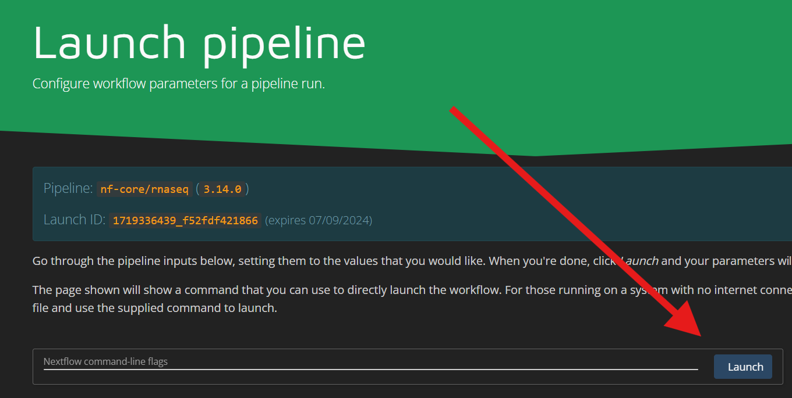
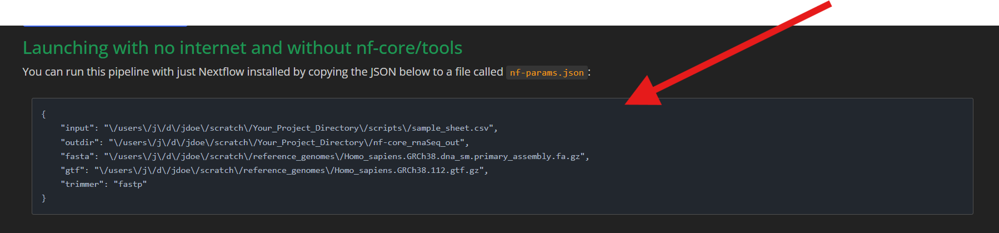
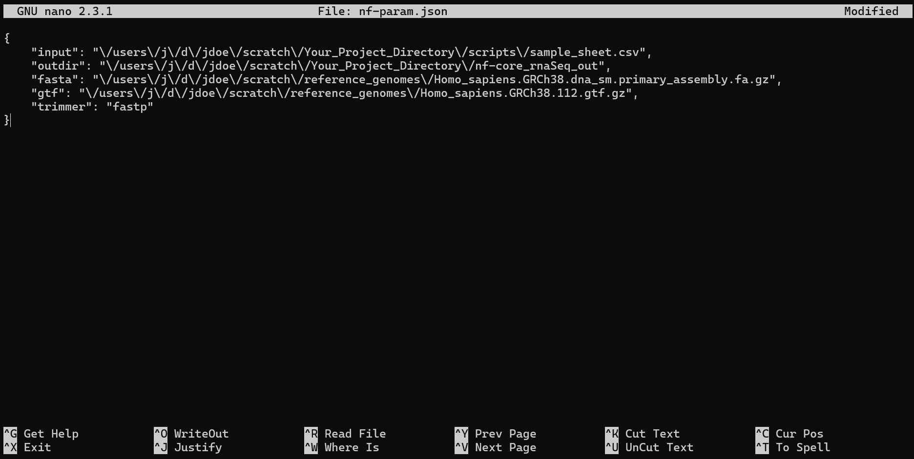
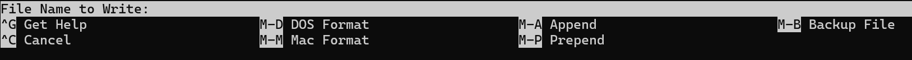

## Process Outline

5. Nextflow pipline setup  
    * param generation
    * adding nf-params.json to project repo

# **Setting up a Nextflow Pipeline**

**Disclaimer** -> This is only cone way to set up a Nextflow Pipeline there are other ways that may be used

The goal at the end of this step is to add a json file to your scripts project directory that includes instuctions for nextflow to locate its input path (your sample sheet), output path (a new empty directory for results), fasta path (your fasta file path for the genome reference library), the gtf path (your gtf file pathfor the genome reference library), and finally the trimmer method you will be using to narrow down the data. 

First follow this link to to the [nf-core/rnaseq site](https://nf-co.re/rnaseq/3.14.0/docs/usage) and Launch the most recent version displayed on the webpage.


You should be brought to this page.


-Fill out the Nextflow Command Line Flags information.  
Highlighted are required fields. These include the project name, as well as some important informations nextflow requires such as the profile which should be altered to reflect the container software you are using, in this case singularity, and resume. Resume has a default value of false. This should almost always be changed to True, this allows you to rerun your program from the last stopping point in case of a timeout or error.


-Fill out Input/Output Options  
Highlighted are required fields. The first field is the input, which is the path to your sample_sheet.csv in the VACC. The output field should be the path to a new directory within your project directory. This output directory does not have to currently exist and if there is not a directory with the given path nextflow will make one. Email is an optional field to recieve a emailed summary upon the pipelines completion. You may also optionally specify the name and header for your multiqc file that will be created during the pipeline process.


-If a reference genome library is being used the paths to the downloaded files should be specified in the Reference Genome options tab.  
You should have a fasta file as well as a gtf file. Put their paths in the highlighted boxes. There are many more optional fields you may fill in accordingly. For more information about the reference genome library downloads see the *Reference Library* section.


-Finally adjust the read trimming options
Change the trimming method in the highlighted drop down box to fastp.


-You can now select the launch button at the top or bottom of the page. 



You wll be brought to a page that contains the contents you will add to your json file in scripts.  
Copy this code.



---
---
# **Adding nf-params.json to the scripts directory**

There are a couple ways you can add the json code you copied to your scripts directory for nextflow to access.  
  
The first and easiest way is with your powershell or command line ssh connection to the VACC.
  
  1. Connect to the VACC via ssh connection
        * see *The VACC* section for more info  

  2. Navigate to your project scripts directory  

  3. Once in your scripts you can use [nano](https://www.nano-editor.org/) text editor to create the json file  
        
        * Intialize the new file 
        ```
        nano 
        ```  
  4. Paste the json contents you previously copied
  
   

  5. Use ctrl-x to exit the text editor.

        * You will be prompted
        
        * type "y"
        * you will be prompted
        
        * type a file name (it must be nf-param.json)  
        * ENTER
 6. Confirm your flie saved with
    ```
    ls
    ```
  

Alternativly you can complete this process by creating the json file on your local device with any prefered text editor instead of nano. With this process though you will need to copy the file to your VACC account later with a file managment tool like filezilla.


