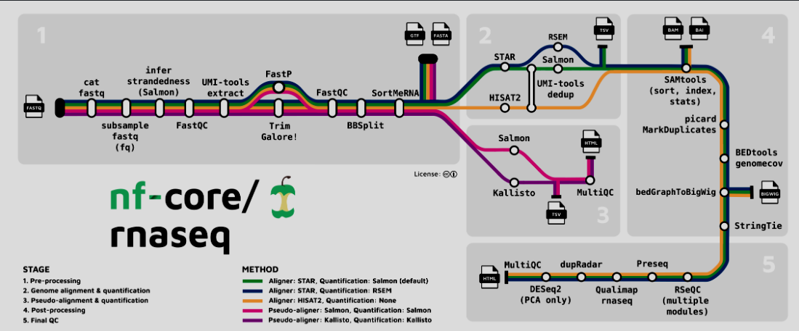

# Using the nf-core/rnaseq Pipeline to Process RNAseq Results


### Why?

The goal of using this pipeline is to:

* Process the results of an rna sequencing experiment into data formats that can be easily used for futher analysis  
* Narrow the size and storage of the raw data into managable files
* Weed out junk that is not needed for future processing
* Provide insight into sequencing and read quality in interpretable formats

### What is a pipeline? 

A pipeline is a series of steps that your data will go through. Each step serves a purpose and feeds into the next.

### The nf-core/rnaseq pipeline

This rnaseq pipeline is split into 5 distinguashable stages:  

1. Pre-processing
2. Genome alignment & quantification
3. Pseudo-alignment & quantification
4. Post-processing
5. Final QC

Each stage of the pipeline has its own steps it must complete. The full processed is visualized here: 

  
Philip Ewels, Alexander Peltzer, Sven Fillinger, Harshil Patel, Johannes Alneberg, Andreas Wilm, Maxime Ulysse Garcia, Paolo Di Tommaso & Sven Nahnsen. Nat Biotechnol. 2020 Feb 13. doi: 10.1038/s41587-020-0439-x.  
Nf-core. Nf-core. Retrieved July 2, 2024, [link](https://nf-co.re/rnaseq/3.14.0/)


### Results

Important files in your results directory are:

```
--nf-core_rnaSeq_out
    --fastp
        --sample1_fastp.html    <--------------
        --sample1_fastp.json     
        --sample2_fastp.html    <--------------
    --fastqc
        --sample1_fastqc.html    <--------------
        --sample1_fastqc.zip     
        --sample2_fastqc.html    <--------------
    --multiqc
    --pipeline_info
    --star_salmon
        --salmon.merged.gene_counts.tsv     <--------------


```